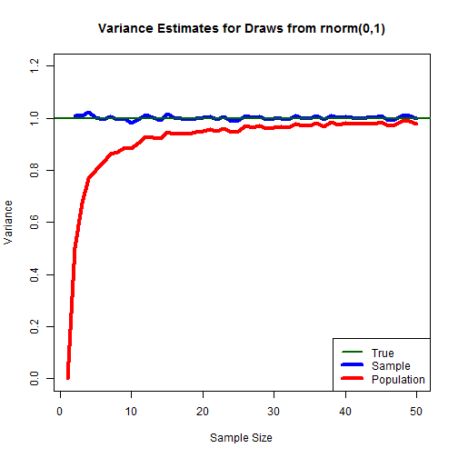
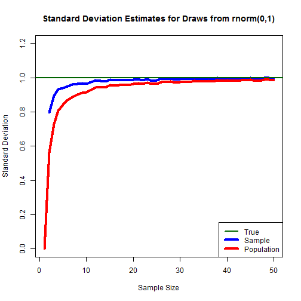

Variance and standard deviation can each be calculated on a population (divide by n) or sample (divide by n-1) basis.  This code is to show those impacts for draws from a normal distribution and a constant distribution.  
  
First, we set up some counter variables.  

```r
myMax <- 50
myDraws <- 2000

sdSam <- rep(0,myDraws)
sdPop <- rep(0,myDraws)
varSam <- rep(0,myDraws)
varPop <- rep(0,myDraws)

mySDSam <- rep(0,myMax)
mySDPop <- rep(0,myMax)
myVarSam <- rep(0,myMax)
myVarPop <- rep(0,myMax)
```
  
Next we loop to pull 1:myMax draws, each taken myDraws number of times, and calculate the resulting standard deviations and variances on a population and sample basis.  


Then, we graph the variance:  

```r
plot(x=1:intCtr,y=myVarSam,type="l",col="blue",ylim=c(0,1.2),lwd=4,
     xlab="Sample Size",ylab="Variance",main="Variance Estimates for Draws from rnorm(0,1)"
     )
lines(x=1:intCtr,y=myVarPop,col="red",lwd=4)
abline(h=1,col="dark green",lwd=2)
legend("bottomright",legend=c("True","Sample","Population"),col=c("dark green","blue","red"),lwd=c(2,4,4))
```



And then the standard deviation:  

```r
plot(x=1:intCtr,y=mySDSam,type="l",col="blue",ylim=c(0,1.2),lwd=4,
     xlab="Sample Size",ylab="Standard Deviation",
     main="Standard Deviation Estimates for Draws from rnorm(0,1)"
     )
lines(x=1:intCtr,y=mySDPop,col="red",lwd=4)
abline(h=1,col="dark green",lwd=2)
legend("bottomright",legend=c("True","Sample","Population"),col=c("dark green","blue","red"),lwd=c(2,4,4))
```



Next, we re-run the code for draws from runif(0,1):  


Then, we graph the variance:  

```r
plot(x=1:intCtr,y=myVarSam,type="l",col="blue",ylim=c(0,0.12),lwd=4,
     xlab="Sample Size",ylab="Variance",main="Variance Estimates for Draws from runif(0,1)"
     )
lines(x=1:intCtr,y=myVarPop,col="red",lwd=4)
abline(h=.0833,col="dark green",lwd=2)
legend("bottomright",legend=c("True","Sample","Population"),col=c("dark green","blue","red"),lwd=c(2,4,4))
```


And then the standard deviation:  

```r
plot(x=1:intCtr,y=mySDSam,type="l",col="blue",ylim=c(0,0.4),lwd=4,
     xlab="Sample Size",ylab="Standard Deviation",
     main="Standard Deviation Estimates for Draws from runif(0,1)"
     )
lines(x=1:intCtr,y=mySDPop,col="red",lwd=4)
abline(h=.289,col="dark green",lwd=2)
legend("bottomright",legend=c("True","Sample","Population"),col=c("dark green","blue","red"),lwd=c(2,4,4))
```


Plainly, the corrected (sample) estimate works very well for calculating variance, and better than the uncorrected (population) estimate - though not perfect - for estimating standard deviation.  
